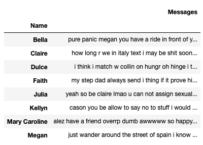

<h1  align="center">Building and Querying Flask API for Natural Language Processing of my friends' iMessages</h1>

<iframe src="https://giphy.com/embed/RiEI5H02TJREuDON0f" width="480" height="270" frameBorder="0" class="giphy-embed" allowFullScreen></iframe>
<aa>

 

 
 
 

<h4 

 
Objective: Build an API which will be used to query an SQL database containing all the messages sent to my iphone via iMessages 
</h4>

The database will be used to perform analyses on messages from each of my friends

Hypothesis: Kellyn is the most frequent, and negative, texter. 
- Motive: cause chaos in the group message 
  

 

 
 

Overview
1. get_messages( ): compile desired messages into a dataframe
2. Build tokenizer( ) function to filter out natural language processing "stop words" and add to dataframe
3. Upload dataframe to SQL Workbench
4. Construct API using Flask in order to query and analyze messages. 

 

DataFrame uploaded to SQL: 

 

